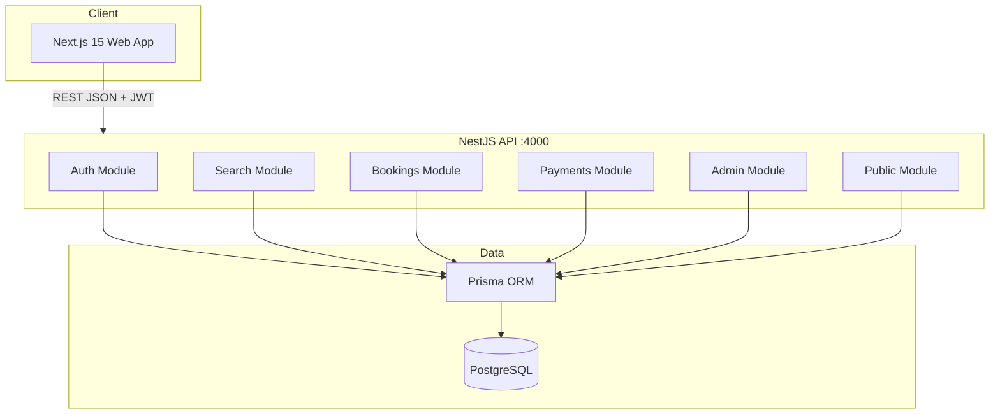

# Architecture — Meru Tour

## High-level diagram



## Frontend (`web/`)

| Layer | Technology |
|-------|------------|
| Framework | Next.js 15 App Router |
| State | Zustand (auth, search), TanStack Query (server state) |
| UI | TailwindCSS, custom components |
| Auth guard | `middleware.ts` — cookie `meru_token`, role `meru_role` for admin |

## Backend (`api/`)

| Module | Responsibility |
|--------|----------------|
| `auth` | Register, login, JWT, verify, reset password |
| `search` | PostgreSQL-backed autocomplete |
| `tours`, `flights`, `hotels`, `hot-tours` | Catalog & filters |
| `bookings` | Create, list, cancel (transaction + seat decrement) |
| `payments` | Stripe intent or dev confirm |
| `favorites`, `reviews`, `notifications` | User features |
| `admin` | CRUD + moderation |
| `public` | Home, stats, footer, newsletter, contact |

## Data strategy (diploma / demo)

**All catalog data comes from PostgreSQL** via Prisma — no mock arrays on the frontend.

Optional integration layer (`api/src/integrations/`) supports a **demo/live hybrid** architecture:
- Without API keys → 100% seed database
- With keys → external offers cached in `ExternalOffer` (not required for defense)

## Security basics

- JWT bearer authentication
- Role-based admin (`ADMIN` / `USER`)
- Global validation pipe (class-validator DTOs)
- Rate limiting on auth routes
- Helmet HTTP headers
- Input whitelist on DTOs

## Deployment (local)

```
docker compose up -d   → PostgreSQL only
npm run start:dev      → API
npm run dev            → Web
```

Production-style Docker images for api/web are optional future work — not required for diploma demo.
