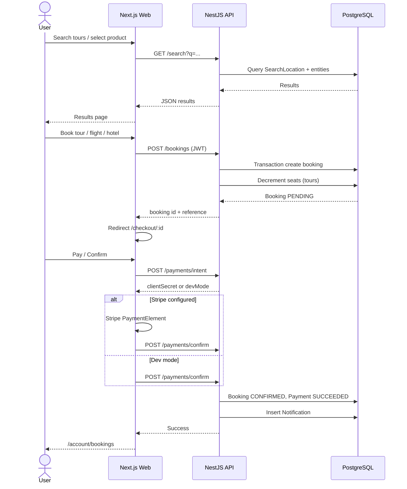
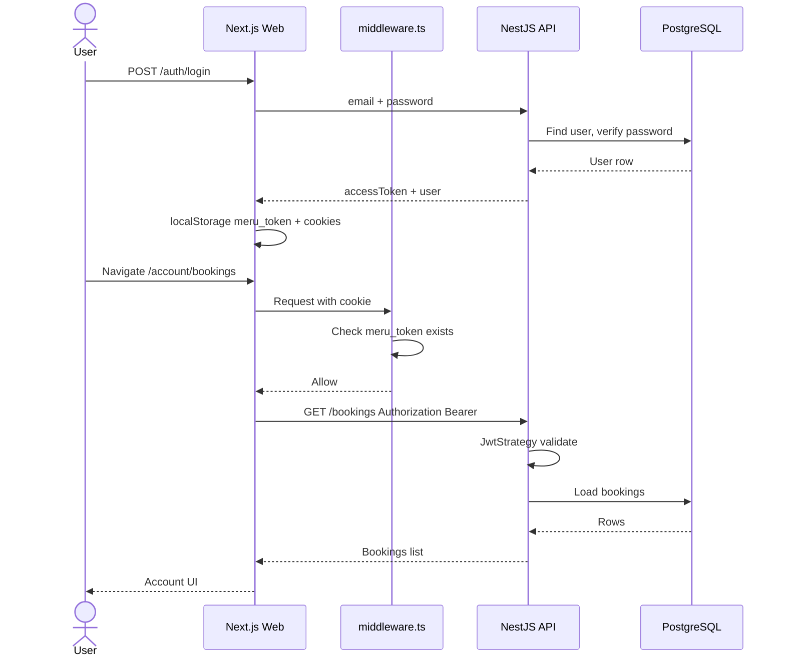
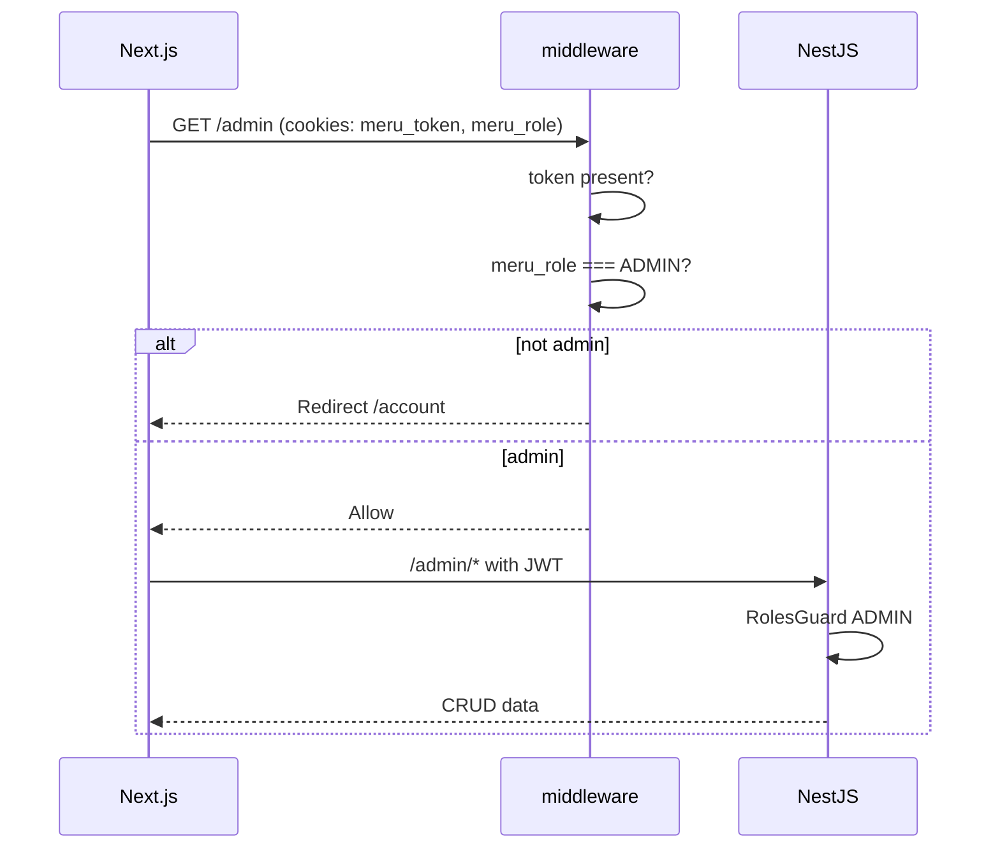

# Sequence Diagrams

## Search → Booking → Checkout

```mermaid
sequenceDiagram
  actor User
  participant Web as Next.js Web
  participant API as NestJS API
  participant DB as PostgreSQL

  User->>Web: Search tours / select product
  Web->>API: GET /search?q=...
  API->>DB: Query SearchLocation + entities
  DB-->>API: Results
  API-->>Web: JSON results
  Web-->>User: Results page

  User->>Web: Book tour / flight / hotel
  Web->>API: POST /bookings (JWT)
  API->>DB: Transaction create booking
  API->>DB: Decrement seats (tours)
  DB-->>API: Booking PENDING
  API-->>Web: booking id + reference
  Web->>Web: Redirect /checkout/:id

  User->>Web: Pay / Confirm
  Web->>API: POST /payments/intent
  API-->>Web: clientSecret or devMode
  alt Stripe configured
    Web->>Web: Stripe PaymentElement
    Web->>API: POST /payments/confirm
  else Dev mode
    Web->>API: POST /payments/confirm
  end
  API->>DB: Booking CONFIRMED, Payment SUCCEEDED
  API->>DB: Insert Notification
  API-->>Web: Success
  Web-->>User: /account/bookings
```

## Login → JWT → Protected route

```mermaid
sequenceDiagram
  actor User
  participant Web as Next.js Web
  participant MW as middleware.ts
  participant API as NestJS API
  participant DB as PostgreSQL

  User->>Web: POST /auth/login
  Web->>API: email + password
  API->>DB: Find user, verify password
  DB-->>API: User row
  API-->>Web: accessToken + user
  Web->>Web: localStorage meru_token + cookies

  User->>Web: Navigate /account/bookings
  Web->>MW: Request with cookie
  MW->>MW: Check meru_token exists
  MW-->>Web: Allow
  Web->>API: GET /bookings Authorization Bearer
  API->>API: JwtStrategy validate
  API->>DB: Load bookings
  DB-->>API: Rows
  API-->>Web: Bookings list
  Web-->>User: Account UI
```

## Admin access

```mermaid
sequenceDiagram
  participant Web as Next.js
  participant MW as middleware
  participant API as NestJS

  Web->>MW: GET /admin (cookies: meru_token, meru_role)
  MW->>MW: token present?
  MW->>MW: meru_role === ADMIN?
  alt not admin
    MW-->>Web: Redirect /account
  else admin
    MW-->>Web: Allow
    Web->>API: /admin/* with JWT
    API->>API: RolesGuard ADMIN
    API-->>Web: CRUD data
  end
```
